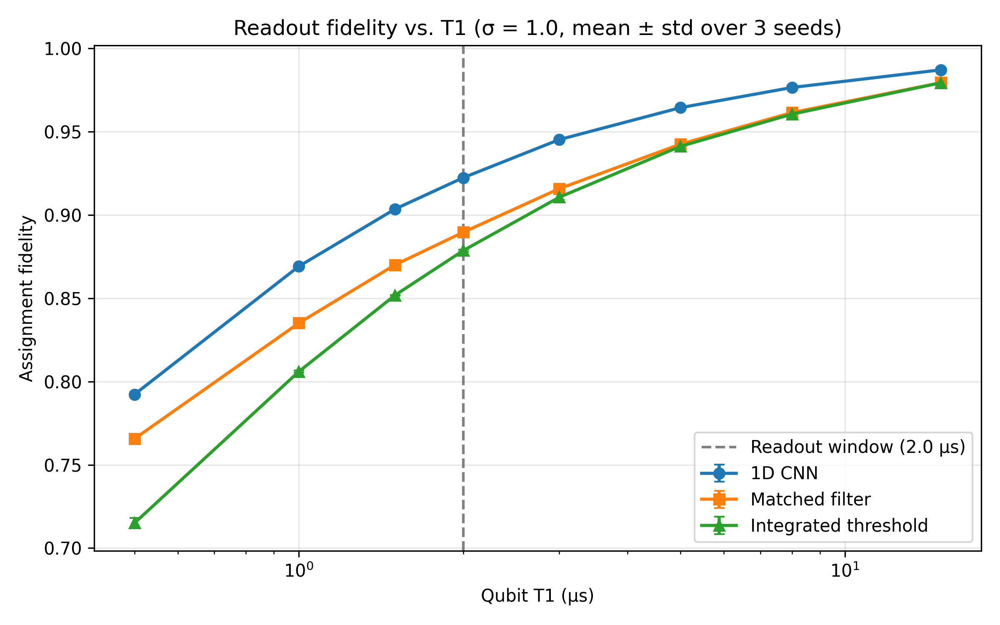

# Qubit Readout Classification with Neural Networks

A small, self-contained project on **dispersive qubit readout**: deciding whether a superconducting qubit was prepared in |0⟩ or |1⟩ from a noisy microwave measurement record. Records are simulated with QuTiP, and a 1D CNN is benchmarked against the standard classical readout methods (integrated threshold and matched filter).

This project is an engineering demonstration rather than novel research. It implements an established concept—that neural networks handle mid-readout qubit relaxation better than linear filters—using a custom QuTiP simulator. The objective is to rigorously benchmark the exact regime where machine learning outperforms classical methods, and where it simply ties them.



---

## The problem

In circuit QED, a qubit is read out through a microwave cavity. The qubit state shifts the cavity response, so a probe tone returns a different complex amplitude α = I + iQ for |0⟩ and |1⟩. The signal is small compared to amplifier noise, so the record has to be combined over time to decide.

The complication is **T1 decay**: a qubit prepared in |1⟩ can relax to |0⟩ during the readout window. The record then switches from "excited-like" to "ground-like" partway through. A plain integrator or a fixed-weight matched filter cannot account for when the switch happens. A network that sees the time structure potentially can.

The metric is **assignment fidelity**, $1 − [P(0|1) + P(1|0)] / 2$, where $0.5$ is guessing and 1.0 is perfect.

## Simulation model

Simulation happens in two stages (units: µs):

1. **Qubit trajectories:** QuTiP `mcsolve` runs quantum-jump trajectories with a T1 collapse operator. Each trajectory is a step function, excited until a random jump time and ground afterwards. Ground-state preparations never jump.
2. **Cavity response:** given the qubit trajectory $s(t) = \pm 1$, the cavity field obeys

   dα/dt = −iε − (κ/2 + iχ·s(t)) α

   which is solved exactly on each time step because s(t) is piecewise constant. Gaussian noise of standard deviation σ is added to each (I, Q) sample.

This is a semi-classical readout model. It does **not** solve the full stochastic master equation for the coupled qubit-cavity system.

Default parameters: T1 = 3, readout window = 2, dt = 0.02 (101 samples), κ = 10, χ = 5, ε = 5, σ = 3.

## Classifiers

| Method | Description |
|---|---|
| Integrated threshold | Sum each quadrature over the record, project onto the class-mean separation, apply a threshold |
| Matched filter | Weight each time step by (mean excited record − mean ground record), sum, apply a threshold |
| 1D CNN | Three conv layers and a dense head on the raw (I, Q) record, no global pooling (so time position is kept) |
| GRU | Small recurrent alternative (`--arch gru`) |

Thresholds are chosen on training data, the best epoch is chosen on a validation set, and all reported numbers come from an independent test set (separate random seeds for each split).

## Results

Sweep over the qubit relaxation time at fixed readout window (2 µs) and noise σ = 1. The table gives approximate values read from the figure (3 seeds each); exact numbers are in `sweep_results.json` after running the sweep.

| T1 (µs) | Integrated | Matched filter | CNN |
|---|---|---|---|
| 0.5 | 0.715 | 0.766 | 0.792 |
| 1.0 | 0.806 | 0.835 | 0.869 |
| 2.0 | 0.878 | 0.889 | 0.922 |
| 3.0 | 0.911 | 0.916 | 0.945 |
| 5.0 | 0.941 | 0.943 | 0.965 |
| 15.0 | 0.980 | 0.980 | 0.987 |

Observations:

- The CNN beats both baselines at every T1, with a gain of about 3 points when T1 is comparable to the readout window.
- The CNN's advantage shrinks as T1 grows and decay becomes rare. The integrated threshold and matched filter coincide for long T1.
- The matched filter gains most over the integrated threshold at short T1, because its weights automatically down-weight late times, when excited qubits have likely relaxed.
- At the default σ = 3 the noise dominates the error: the CNN (0.829) is within statistical noise of the matched filter (0.823).

## Limitations

- Everything is simulated from a model I wrote, so the results show that the network learns structure a linear filter cannot, not that it would work on a real device.
- The cavity part is a linear semi-classical model, and there is no multi-qubit crosstalk yet.
- Hyperparameters are not tuned. The CNN is trained with fixed settings for 20-30 epochs, so its numbers are likely lower bounds.
- Sweeps use 3 seeds. Small gaps (below roughly a point) should not be over-interpreted.
- There is no Bayes-optimal reference yet, so it is unknown how close the CNN is to the best possible classifier.

## Project structure

```
sim/engine.py              QuTiP jump trajectories + cavity response + noise
model/readout_model.py     ReadoutCNN and ReadoutGRU
data/generate_data.py      Dataset generation (train/val/test, independent seeds)
train/arguments.py         All command-line arguments (physics, data, training)
train/train.py             Training, validation, and comparison with the baselines
baselines.py               Integrated threshold, matched filter, assignment fidelity
plot_records.py            Raw records, class-mean records, matched-filter histograms
sweep.py                   T1 sweep with several seeds, JSON output and plot
generate.sh / run_train.sh Convenience scripts with the default settings
```

## Quick start

```bash
pip install qutip torch numpy matplotlib tqdm     # QuTiP >= 5

python -m sim.engine        # simulator sanity checks (decay statistics, cavity steady state)
./generate.sh               # simulate the dataset
python baselines.py         # baseline fidelities
./run_train.sh              # train the CNN and compare against the baselines
```

Any argument can be overridden at the end of the command, for example:

```bash
./generate.sh --sigma 1.0 --T1 2.0 --data-path data/sigma1.pt
./run_train.sh --data-path data/sigma1.pt --arch gru --checkpoint-dir checkpoints/gru/
python sweep.py             # full T1 sweep, writes sweep_results.json and t1_fidelity_sweep.png
```

Training uses Apple Silicon (MPS) when `--device mps` is set and falls back to CPU if it is unavailable.

## Sanity checks built into the simulator

`python -m sim.engine` verifies both stages independently:

1. The mean of many excited-qubit trajectories matches exp(−t/T1) up to shot noise.
2. The noise-free cavity field converges to the analytic steady state −iε / (κ/2 + iχ).

## Possible extensions

- Bayes-optimal classifier (marginalizing over the decay time) as a performance ceiling.
- Two- and three-qubit multiplexed readout with signal leakage and state-dependent shifts between resonators, comparing independent matched filters, a joint linear filter, and a joint network.
- Noise sweeps, and training-set-size scaling.

## Earlier version of this repository

The project began as a parameter-fitting and pulse-control pipeline for a driven Jaynes-Cummings system using a neural surrogate. It turned out that a small, well-modeled system gives a neural network little to do beyond what a classical solver already does, so I moved to a problem where the learned model addresses something a linear method cannot. The earlier code is kept in `old_jc_control/`.

## References

* **PyTorch** for the neural networks and training loops.
* **QuTiP** for the quantum-jump simulation. If you build on the QuTiP parts of this project, please cite:
  > J. R. Johansson, P. D. Nation, and F. Nori, "QuTiP 2: A Python framework for the dynamics of open quantum systems," Comput. Phys. Commun. **184**, 1234 (2013).
  >
  > N. Lambert et al., "QuTiP 5: The Quantum Toolbox in Python," arXiv:2412.04705 (2024).
* **NumPy & Matplotlib** for data handling and plotting.
